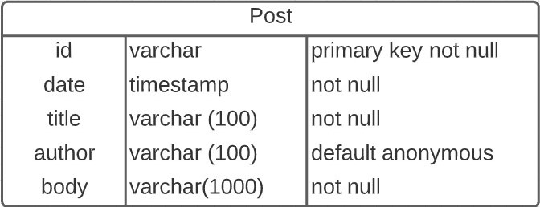

# Memoriae

Anonymously post your thoughts and memoriaes

## Installation & Usage

### Installation

- Clone or download the repo

### Usage

- Go to the project folder
- Open the bash terminal
- Run: `bash _scripts/startDev.sh`
- You will find:
  - Client in [localhost:3000](http://localhost:3000/) 
  - Server in [localhost:5000](http://localhost:5000/)
- To close the app:
  - Open a new bash terminal in the project folder
  - Run: `bash _scripts/stop.sh`
- To destroy any remain of the app:
  - Open a new bash terminal in the project folder
  - Run: `bash _scripts/teardown.sh`

## Technologies

  
<b>Environment</b>

- [Docker](https://www.docker.com/)

  
<b>Client</b>

  
  - HTML
  - CSS
  - JavaScript
  - [NPM](https://www.npmjs.com/)
    - [lite-server](https://www.npmjs.com/package/lite-server)
    - [concurrently](https://www.npmjs.com/package/concurrently)
    - [watchify](https://www.npmjs.com/package/watchify)

  
<b>Server</b>

- [NodeJs](https://nodejs.org/en/)
- [NPM](https://www.npmjs.com/)
  - [express](https://www.npmjs.com/package/express)
  - [cors](https://www.npmjs.com/package/cors)
  - [morgan](https://www.npmjs.com/package/morgan)
  - [uuid](https://www.npmjs.com/package/uuid)
  - [nodemon](https://www.npmjs.com/package/nodemon)
  - [pg](https://www.npmjs.com/package/pg)

  
<b>Database</b>

- [PostgreSQL](https://www.postgresql.org/)

## API

| Route Name | URL        | HTTP Verb | Description             |
| ---------- | ---------- | --------- | ----------------------- |
| Root       | /          | GET       | Test api is initialised |
| Create     | /posts     | POST      | Create a post           |
| Show       | /posts/:id | GET       | Show info about a post  |

## Database Schema

## Changelog

Find the full changelog [here](./changelog.md)

## Bugs

## Licence

[MIT Licence](https://opensource.org/licenses/mit-license.php)
